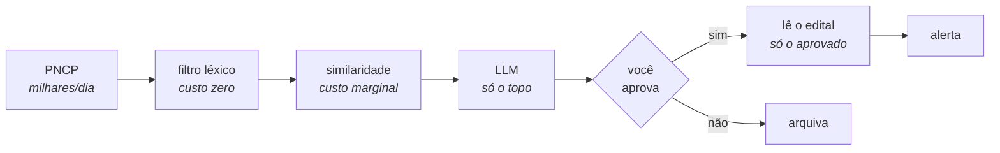
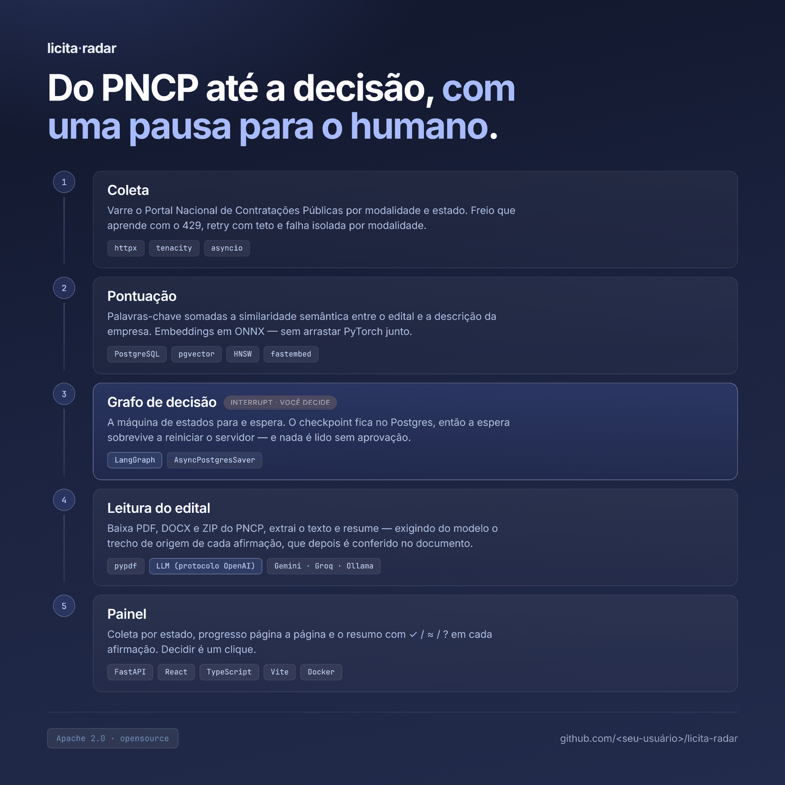

<div align="center">

# licita-radar

**Um radar de licitações públicas que também lê o edital.**

Varre o [PNCP](https://pncp.gov.br), entende o que a sua empresa vende, avisa só quando aparece algo que vale disputar — e, do que você aprovar, baixa o edital e devolve um resumo executivo **com o trecho do documento ao lado de cada afirmação**.

[](pyproject.toml)
[](https://fastapi.tiangolo.com)
[](docs/decisoes/0001-langgraph-em-vez-de-orquestracao-propria.md)
[](docs/decisoes/0003-postgres-e-pgvector-em-um-servico-so.md)
[](web)
[](docker-compose.yml)
[](.github/workflows/ci.yml)
[](pyproject.toml)
[](LICENSE)


</div>

> [!WARNING]
> **Em construção.** A v0.1 ainda não está publicada. Hoje o projeto coleta do PNCP (M1), pontua contra o seu perfil (M2), roda o grafo com revisão humana (M3), analisa o edital (M4), serve o painel (M5) e alerta no Telegram (M6). O [roadmap](#roadmap) diz o que falta.

---

## Sumário

- [O problema](#o-problema)
- [A proposta](#a-proposta)
- [O analista de editais](#o-analista-de-editais)
- [Começando](#começando)
- [Os comandos](#os-comandos)
- [Usando no dia a dia](#usando-no-dia-a-dia)
- [O perfil é a interface](#o-perfil-é-a-interface)
- [Arquitetura](#arquitetura)
- [O que o PNCP não conta na documentação](#o-que-o-pncp-não-conta-na-documentação)
- [Roadmap](#roadmap)
- [Desenvolvimento](#desenvolvimento)
- [Decisões de arquitetura](#decisões-de-arquitetura)

---

## O problema

Centenas de órgãos públicos publicam contratações no PNCP todos os dias. Uma empresa pequena de software não tem ninguém para vasculhar isso — então perde por desconhecimento contratos que ganharia por mérito. Quem tem estrutura paga assinatura de portal de licitações. Quem não tem, descobre tarde.

E descobrir é só metade. A dor de quem disputa licitação não é saber que o edital existe: é **entender o edital**. Oitenta páginas de juridiquês decidem se vale participar, e ler isso exige um profissional caro e escasso.

## A proposta

Você descreve o que a sua empresa vende **uma vez**, num arquivo YAML. O licita-radar faz o resto:



A ordem importa: as camadas caras vêm **depois** das baratas. Se cada contratação passasse por um modelo de linguagem, o projeto seria lento e caro. Do jeito que está, o LLM vê menos de 1% do que entra — e o edital em PDF, menos ainda: só é baixado e lido depois que uma pessoa disse que aquela licitação interessa.

## O analista de editais

O `licita-radar analisar` baixa os anexos, extrai o texto e devolve o que importa — objeto real, exigências de habilitação, garantia, prazos, pagamento, multas e riscos. **Cada afirmação vem com o trecho literal do edital que a sustenta, e cada trecho é procurado de volta no documento original antes de aparecer na tela:**

```
✓ Pede atestado de capacidade técnica compatível com o objeto.
  "apresentar atestado de capacidade técnica, fornecido por pessoa jurídica"

? Exige certificação ISO 27001 válida.
  "a licitante deverá comprovar certificação ISO 27001 vigente"
  o trecho citado não existe no edital
```

| marca | significado |
|:--:|---|
| `✓` | o trecho existe no edital, literalmente |
| `≈` | o trecho existe, mas algum número dele não bate |
| `?` | o trecho citado não foi encontrado no documento |

O `?` é o ponto. Um resumo que inventa uma exigência faz a empresa desistir de uma licitação que venceria — e quem pediu o resumo é justamente quem não vai reler as oitenta páginas para perceber. A conferência é determinística, não custa uma chamada a mais de modelo, e está descrita em [`docs/decisoes/0007`](docs/decisoes/0007-toda-afirmacao-carrega-o-trecho-que-a-prova.md).

---

## Começando

**Requisitos:** Python 3.11+ e Postgres 14+ (o `docker compose` sobe um para você).

```bash
git clone https://github.com/SEU-USUARIO/licita-radar.git
cd licita-radar

docker compose up -d db                  # banco com pgvector já habilitado

python -m venv .venv && source .venv/bin/activate
pip install -e ".[dev]"

cp .env.exemplo .env
cp perfil.exemplo.yaml perfil.yaml       # <- edite este arquivo

licita-radar migrar
licita-radar perfil                      # confere como o perfil foi interpretado
licita-radar ingest --uf GO
licita-radar listar
```

No Windows, troque `source .venv/bin/activate` por `.venv\Scripts\Activate.ps1`.

<details>
<summary><b>Já tenho um Postgres na máquina</b></summary>

Não precisa desinstalar nem lembrar a senha dele — o `docker compose` sobe um container próprio, com usuário e senha `licita`. Se o compose reclamar que *a porta já está em uso*, ponha `LR_DB_PORT=5433` no `.env`, troque a porta também na `LR_DATABASE_URL`, e suba de novo.

Prefere usar o seu? Aponte `LR_DATABASE_URL` para ele — só precisa da extensão `vector` disponível.

</details>

<details>
<summary><b>Travou? <code>licita-radar doctor</code></b></summary>

```
Ambiente
  ✓ Python 3.12.3  win32
  ✓ event loop  WindowsSelectorEventLoopPolicy
  ✓ perfil (perfil.yaml)  Acme Software
  ! camada semântica  fastembed não instalado
      → opcional: pip install -e ".[semantico]"

Banco
  ✓ resolver 127.0.0.1  127.0.0.1
  ✗ porta 5432 aberta  Connection refused
      → suba o banco: docker compose up -d db
```

Ele testa cada camada separadamente — Python, event loop, perfil, DNS, porta TCP, autenticação, extensão, migrações, a API do PNCP e o modelo de linguagem — e para no primeiro problema, com a instrução do conserto.

O princípio: **um diagnóstico que diz "falhou" não é um diagnóstico.** Metade dos bugs deste projeto era erro sem mensagem, timeout que na verdade era cota estourada, ou tela branca sem stack.

</details>

## Os comandos

| Comando | O que faz |
|---|---|
| `licita-radar migrar` | Cria ou atualiza o esquema do banco |
| `licita-radar perfil` | Valida o `perfil.yaml` e mostra como ele foi lido |
| `licita-radar ingest` | Busca contratações no PNCP e grava. `--seco` mostra sem gravar |
| `licita-radar listar` | Mostra o que está guardado, com proposta ainda aberta |
| `licita-radar match` | Pontua tudo contra o seu perfil e mostra o funil |
| `licita-radar radar` | Passa as contratações pelo grafo, até a revisão humana |
| `licita-radar revisar` | Mostra o que espera decisão; ao aprovar, já lê o edital |
| `licita-radar documentos` | Lista (e baixa, com `--baixar`) os anexos de uma contratação |
| `licita-radar analisar` | Resume o edital com o trecho de origem em cada afirmação |
| `licita-radar atualizar` | Coleta, pontua e roda o grafo — o ciclo inteiro, para agendar |
| `licita-radar servir` | Sobe a API e o painel web |
| `licita-radar alertar` | Confere o canal do Telegram e ajuda a configurá-lo |
| `licita-radar doctor` | Diagnostica o ambiente quando algo não funciona |

---

## Usando no dia a dia

<details open>
<summary><b>Onde procurar</b></summary>

```bash
licita-radar ingest --uf GO                  # uma UF
licita-radar ingest --brasil                 # o país inteiro (leva alguns minutos)
licita-radar ingest --ate 90                 # propostas que encerram nos próximos 90 dias
licita-radar ingest --historico --dias 30    # backfill por data de publicação
```

Para filtrar por esfera de governo, use o perfil:

```yaml
restricoes:
  ufs: []              # vazio = Brasil inteiro
  esferas: ["F"]       # só o governo federal — E estadual, M municipal
```

</details>

<details>
<summary><b>Mantendo o radar atualizado</b></summary>

Nada roda sozinho: o painel é uma janela sobre o que estes passos produziram.

```bash
licita-radar atualizar        # ingest + match + radar, de uma vez
```

O painel tem o mesmo ciclo no botão **Atualizar editais**: ele volta na hora, roda em segundo plano e o próprio botão vira o relatório de progresso — *buscando contratações no PNCP*, *comparando com o seu perfil*, *passando pelo grafo*.

O cabeçalho mostra **quando foi a última coleta** e fica âmbar quando passa de um dia — porque uma tela com dado de quatro dias atrás é indistinguível de uma tela atualizada agora, e quem olha conclui que o PNCP é que parou de publicar.

Para rodar todo dia de manhã, agende o comando no seu sistema. No Windows, pelo **Agendador de Tarefas**; no Linux ou macOS, no `cron`:

```cron
0 7 * * 1-5  cd /caminho/do/licita-radar && .venv/bin/licita-radar atualizar
```

Licitação com prazo vencido some da lista por padrão — ela ocupa espaço e não há nada a fazer a respeito. O contador `+N encerradas` no topo traz de volta quando você quiser.

</details>

<details>
<summary><b>O painel</b></summary>

```bash
pip install -e ".[web]"
licita-radar servir            # http://127.0.0.1:8000
```

A tela lista as candidatas por score, mostra por que cada uma apareceu e deixa aprovar ou rejeitar ali mesmo — aprovar baixa o edital e o resume, com o trecho de origem embaixo de cada afirmação e a marca ✓ / ≈ / ? ao lado. Há um seletor de UF para coletar estado a estado, e o progresso aparece página a página.

A decisão retoma o mesmo grafo do `licita-radar revisar`: as duas interfaces conversam com o mesmo checkpoint.

Para mexer no front:

```bash
cd web && npm install
npm run dev                    # http://localhost:5173, recarrega ao salvar
npm run build                  # gera web/dist, que o `servir` passa a entregar
```

Sem `web/dist`, o `servir` entrega só a API — e ela sozinha já é útil, com documentação interativa em `/docs`.

</details>

<details>
<summary><b>O alerta no Telegram</b></summary>

```bash
licita-radar alertar --descobrir   # depois de mandar /start para o seu bot
licita-radar alertar --teste
```

Dois avisos chegam, em momentos diferentes e por razões diferentes:

- **quando o `radar` termina** — *"3 esperando a sua decisão"*, com objeto, órgão, prazo, score e a frase que explica por que apareceu
- **quando você aprova** — o resumo do edital, com as marcas ✓ / ≈ / ?

A separação não é detalhe. Aprovar é o que dispara a leitura do edital, então num `radar` agendado às 7h ninguém aprovou nada — se o alerta só existisse depois da aprovação, o canal ficaria mudo justamente na hora em que ele é mais útil. ([`docs/decisoes/0008`](docs/decisoes/0008-o-alerta-vem-antes-da-aprovacao.md))

Sem token configurado, o canal fica desligado e o alerta vai para o log.

</details>

<details>
<summary><b>Calibrando sem baixar modelo</b></summary>

```bash
licita-radar match --sem-semantica
```

Roda só a camada léxica. Não baixa nada, responde em milissegundos, e é o jeito certo de ajustar as palavras-chave do perfil antes de ligar a semântica. A saída mostra o funil inteiro:

```
O funil
  não passou nos filtros           9  ███████████████
  vetada por palavra negativa      0
  abaixo do limiar                 3  █████
  candidata — merece o seu olho    0
```

Para ligar a camada semântica:

```bash
pip install -e ".[semantico]"    # ~200 MB, sem PyTorch
licita-radar match
```

O modelo (`paraphrase-multilingual-MiniLM-L12-v2`, 384 dimensões) é baixado na primeira execução e fica em cache.

</details>

<details>
<summary><b>Escolhendo o modelo de linguagem</b></summary>

A camada de LLM fala o **protocolo da OpenAI**, então qualquer provedor compatível serve — trocando duas variáveis no `.env`:

```bash
LR_LLM_BASE_URL=https://generativelanguage.googleapis.com/v1beta/openai
LR_LLM_MODELO=gemini-2.5-flash
LR_LLM_API_KEY=...        # nunca versionado: o .env está no .gitignore
```

Funciona com Gemini, Groq e Ollama local. O `doctor` testa o modelo configurado de verdade — e sabe distinguir os **dois 429 diferentes** que os provedores gratuitos devolvem: o que diz *"devagar"* (limite por minuto, passa em segundos) do que diz *"volte amanhã"* (cota diária). Tratá-los igual desperdiça minutos e ainda esconde a única informação útil.

</details>

---

## O perfil é a interface

Todo o conhecimento de negócio mora em um arquivo. Veja o [`perfil.exemplo.yaml`](perfil.exemplo.yaml) completo; o trecho que mais importa é este:

```yaml
foco: Editais de TI          # aparece no cabeçalho do painel

descricao: |                 # vira o embedding que representa a empresa
  Fábrica de software sob demanda. Desenvolvimento de sistemas web,
  APIs de integração, sustentação evolutiva de sistemas legados e
  alocação de squad de desenvolvimento para órgãos públicos.

palavras_chave:
  positivas:
    - desenvolvimento de software
    - sustentação de sistemas
  negativas:                 # o filtro que mais aumenta a precisão
    - toner
    - cabeamento estruturado
    - link de internet
```

**Sobre as palavras negativas:** buscar "TI" no PNCP devolve toner, cartucho, cabeamento estruturado e nobreak. Essa lista vale mais para a qualidade do resultado do que qualquer sofisticação de modelo. Se o seu alerta estiver ruidoso, é quase sempre aqui que se conserta.

E sobre a `descricao`: escreva serviços concretos. *"Empresa de tecnologia e inovação"* casa com qualquer coisa — ou seja, com nada.

---

## Arquitetura



| Camada | O que carrega |
|---|---|
| **Coleta** | `httpx` + `tenacity`, freio adaptativo que aprende com o 429, falha isolada por modalidade |
| **Pontuação** | palavras-chave + similaridade semântica, `pgvector` com índice HNSW, embeddings em ONNX via `fastembed` |
| **Decisão** | `LangGraph` com `interrupt()` e checkpoint em Postgres — a espera sobrevive a reiniciar o servidor |
| **Leitura** | extração de PDF, DOCX e ZIP; LLM pelo protocolo da OpenAI; conferência determinística de cada citação |
| **Interfaces** | CLI em `typer` + `rich`, API em `FastAPI`, painel em React + TypeScript + Vite |

O projeto inteiro é assíncrono (`asyncio` + `psycopg` 3), com tipagem checada em `mypy --strict`.

---

## O que o PNCP não conta na documentação

A [API de consultas](https://pncp.gov.br/api/consulta/swagger-ui/index.html) é pública e não pede chave. O que se descobre apanhando:

<details>
<summary><b>A modalidade é obrigatória e única por chamada</b></summary>

Não existe "me dê tudo": você itera sobre os códigos que interessam. Os relevantes para software:

| Código | Modalidade |
|---:|---|
| 6 | Pregão — Eletrônico |
| 8 | Dispensa de Licitação |
| 4 | Concorrência — Eletrônica |
| 9 | Inexigibilidade |
| 12 | Credenciamento |

</details>

<details>
<summary><b>O <code>dataFinal</code> é o fim do prazo, não "até quando olhar"</b></summary>

Passar a data de hoje devolve o que encerra hoje — ou seja, quase tudo já fechado. Numa coleta real, 31 de 37 contratações vieram com prazo vencido por causa disso. A data precisa estar no futuro: é o que a opção `--ate` controla.

</details>

<details>
<summary><b>A dispensa domina o volume, e ela é barata</b></summary>

Numa amostra real de Goiás, 36 das 37 contratações abertas eram dispensa (modalidade 8), com valores entre R$ 900 e R$ 13 mil. Um `valor_minimo` de 50 mil no perfil elimina praticamente toda a modalidade — justamente aquela em que a empresa pequena tem chance.

</details>

<details>
<summary><b>O objeto vem coberto de casca burocrática</b></summary>

`DESPESA REFERENTE A`, `SOLICITAÇÃO DE`, `1 -TERMO DE SOLICITAÇÃO`, `[Portal de Compras Públicas] - DISPENSA -`. Esse prefixo é idêntico em licitação de software e de picolé; o projeto remove antes de comparar, senão a busca semântica aproxima coisas que não têm nada a ver.

</details>

<details>
<summary><b>Há limite de requisições, e ele não está documentado</b></summary>

Uma varredura nacional levou `429 Too Many Requests` a partir da página 16 — e, pior, a modalidade seguinte já começou bloqueada: o limite é por cliente, não por rota. O projeto responde com um freio adaptativo que espaça todas as chamadas, dobra o espaçamento a cada 429 e o reduz conforme as respostas voltam a passar. Também honra o cabeçalho `Retry-After` quando o servidor manda um. ([`docs/decisoes/0005`](docs/decisoes/0005-freio-adaptativo-no-cliente-do-pncp.md))

</details>

<details>
<summary><b>No Windows, o psycopg exige trocar o event loop</b></summary>

O `asyncio.run()` de lá usa o `ProactorEventLoop`, incompatível com o psycopg assíncrono: a conexão falha com `InterfaceError` antes de tocar a rede, e o sintoma parece problema de rede. A CLI troca a política na importação; se você usar o pacote como biblioteca, faça o mesmo.

</details>

<details>
<summary><b>O nome do modelo de embedding não garante que dois vetores são comparáveis</b></summary>

O `fastembed` 0.7 trocou *CLS pooling* por *mean pooling* no mesmo modelo, com o mesmo nome. Comparar um vetor antigo com um novo não falha: devolve um número plausível e errado. Por isso a identidade do vetor guardada no banco inclui a versão da biblioteca, não só o nome do modelo — quando ela muda, os embeddings são recalculados em vez de silenciosamente misturados.

</details>

---

## Roadmap

| | Marco | Estado |
|---|---|---|
| M0 | Fundação: repositório, CI, banco | ✅ |
| M1 | Ingestão do PNCP | ✅ |
| M2 | Funil de matching (léxico + semântico) | ✅ |
| M3 | Grafo LangGraph com checkpoint e revisão humana | ✅ |
| M4 | Analista de editais: download, extração e resumo com citação | ✅ |
| M5 | Painel web: API HTTP e a tela de decisão | ✅ |
| M6 | Alerta no Telegram | ✅ |
| M7 | Acabamento e release `v0.1.0` | ⬜ |

O alerta desceu na fila de propósito: sem o resumo do edital, ele avisaria a mesma coisa que os portais de licitação já avisam. Fora do escopo, ainda: múltiplos perfis e OCR de edital digitalizado — estão em [`docs/roadmap.md`](docs/roadmap.md) esperando a vez.

---

## Desenvolvimento

```bash
pytest              # nenhum teste toca a rede: tudo roda contra fixtures
ruff check .
mypy
```

Os testes usam [respx](https://lundberg.github.io/respx/) para interceptar o HTTP. Um CI que depende de um serviço externo estar no ar é um CI que quebra sozinho.

> `tests/fixtures/pncp/amostra_real_go.json` traz **12 contratações reais** de Goiás, capturadas em 04/09/2026 — é contra elas que o matching é testado. Para capturar as suas: `LR_PNCP_CACHE_LOCAL=true licita-radar ingest --seco` grava o que a API devolveu em `.cache_pncp/`.

Contribuições são bem-vindas — veja o [CONTRIBUTING.md](CONTRIBUTING.md).

## Decisões de arquitetura

Cada decisão que mudou o rumo do projeto está registrada com o contexto e as alternativas descartadas:

| | Decisão |
|---:|---|
| [0001](docs/decisoes/0001-langgraph-em-vez-de-orquestracao-propria.md) | LangGraph em vez de orquestração própria |
| [0002](docs/decisoes/0002-a-v01-nao-le-o-edital.md) | A v0.1 não lê o edital *(revertida pela 0006)* |
| [0003](docs/decisoes/0003-postgres-e-pgvector-em-um-servico-so.md) | Postgres e pgvector em um serviço só |
| [0004](docs/decisoes/0004-fastembed-em-vez-de-sentence-transformers.md) | fastembed em vez de sentence-transformers |
| [0005](docs/decisoes/0005-freio-adaptativo-no-cliente-do-pncp.md) | Freio adaptativo no cliente do PNCP |
| [0006](docs/decisoes/0006-o-analista-de-editais-muda-o-produto.md) | O analista de editais muda o produto |
| [0007](docs/decisoes/0007-toda-afirmacao-carrega-o-trecho-que-a-prova.md) | Toda afirmação carrega o trecho que a prova |
| [0008](docs/decisoes/0008-o-alerta-vem-antes-da-aprovacao.md) | O alerta vem antes da aprovação |

## Licença

[Apache 2.0](LICENSE).
